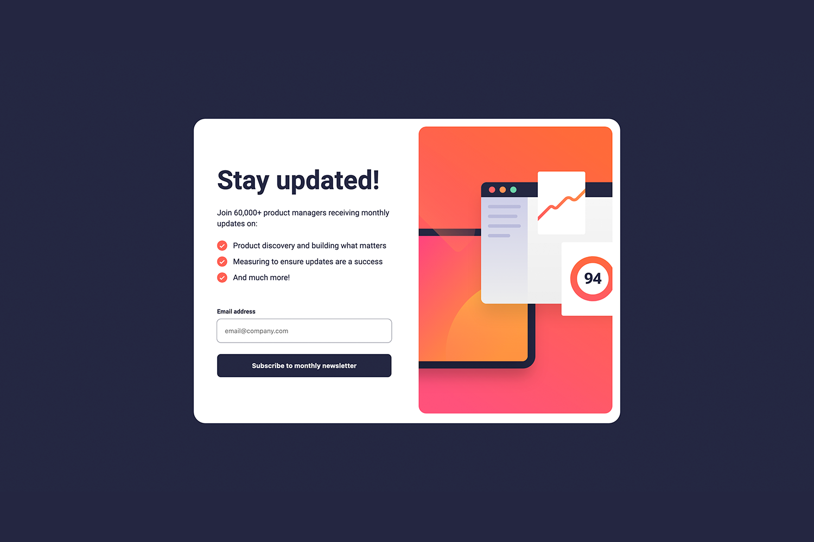
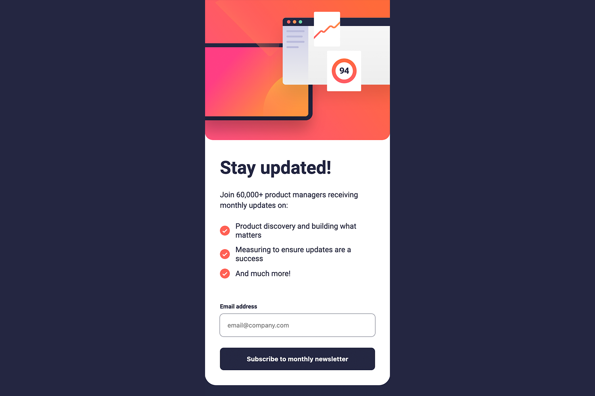

### Links

- Solution URL: [https://www.frontendmentor.io/solutions/newsletter-sign-up-with-success-message-css-grid-and-flexbox-BzMS0Yc9YC](https://www.frontendmentor.io/solutions/newsletter-sign-up-with-success-message-css-grid-and-flexbox-BzMS0Yc9YC)
- Live Site URL: [https://user9511.github.io/frontend-mentor-newsletter-sign-up-with-success-message-main/](https://user9511.github.io/frontend-mentor-newsletter-sign-up-with-success-message-main/)

# Frontend Mentor - Newsletter sign-up form with success message solution

This is a solution to the [Newsletter sign-up form with success message challenge on Frontend Mentor](https://www.frontendmentor.io/challenges/newsletter-signup-form-with-success-message-3FC1AZbNrv). Frontend Mentor challenges help you improve your coding skills by building realistic projects.

## Table of contents

- [Links](#links)
- [The challenge](#the-challenge)
- [Screenshot](#screenshot)
- [Built with](#built-with)
- [Author](#author)

### The challenge

Users should be able to:

- Add their email and submit the form
- See a success message with their email after successfully submitting the form
- See form validation messages if:
- The field is left empty
- The email address is not formatted correctly
- View the optimal layout for the interface depending on their device's screen size
- See hover and focus states for all interactive elements on the page

### Screenshot

Desktop

Mobile

### Built with

- Semantic HTML5 markup
- CSS custom properties
- Flexbox
- CSS Grid
- JavaScript

## Author

- Website - [https://www.linkedin.com/in/shanemcgeown/](https://www.linkedin.com/in/shanemcgeown/)
- Frontend Mentor - [@User9511](https://www.frontendmentor.io/profile/User9511)
